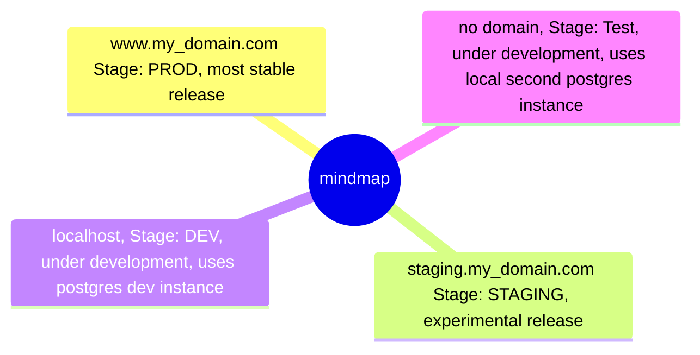

# Fastapi sqlmodel webserver

## Requirements

- Python >=3.8.1 <3.13 with `uv` installed
- Docker with docker compose installed

## Launch local dev server

Start database (postgres) and minio
```
docker compose --profile dev up
```

Install dependencies with 
```sh
uv sync
```

Open a Python file in the `fastapi_server` folder and select the correct python environment in the bottom right of vscode.

Start webserver with `uv run src/app.py` or via the vscode debug config `Start LiteStar`.

If you run it for the first time, the database schema needs to be generated and pushed to postgres
```sh
uv run prisma generate
uv run prisma migrate reset
```

Now you can go to http://0.0.0.0:8000 or http://0.0.0.0:8000/schema to check out the documentation to all endpoints.

Under http://pgadmin.localhost you can `register` the postgres instance with host name `fastapi_dev_postgres`, port `5432`, username `root` and password `root` and keep database as `postgres` and now click on `save`. You will now be able to browse the database tables and data.

# Ideal structure of the project

